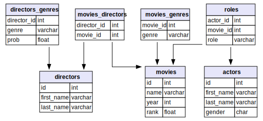

# IMDB dataset

You might know the Internet Movie Database, commonly called [IMDB](https://www.imdb.com/).

Well it's a simple example to showcase some of Elasticsearch capabilities.

In this case, relational databases (SQL) are a good fit to store with consistence this kind of data.
Yet indexing some of this data in a optimized search engine will allow more powerful queries.

## Query requirements
In this example, we'll suppose most usage/queries requirements will be around the concept of movie (rather than usages 
focused on fetching actors or directors, even though it will still be possible with this data structure).

The index should provide good performances trying to answer these kind question (non-exhaustive):
- in which movies this actor played?
- what movies genres were most popular among decades?
- which actors have played in best-rated movies, or worst-rated movies?
- which actors movies directors prefer to cast in their movies?
- which are best ranked movies of last decade in Action or Documentary genres? 
- ...


## Data source
I exported following SQL tables from MariaDB [following these instructions](https://relational.fit.cvut.cz/dataset/IMDb).

Relational schema is the following:

 

## Index mapping

#### Overview
The base unit (document) will be a movie, having a name, rank (ratings), year of release, a list of actors
and a list of directors.

Schematically:
```
Movie:
 - name
 - year
 - rank
 - [] genres
 - [] directors
 - [] actor roles
```

#### Which fields require nesting?
Since genres contain a single keyword field, in no case we need it to be stored as a nested field.
On the contrary, actor roles and directors require a nested mapping if we consider applying multiple 
simultanous query clauses on their sub-fields (for instance search movie in which actor is a woman AND whose role is 
nurse). 
More information on distinction between array and nested fields [here](
https://www.elastic.co/guide/en/elasticsearch/reference/current/nested.html).


#### Text or keyword fields?
Some fields are easy to choose, in no situation gender will require a full text search, thus we'll store
it as a keyword.
On the other hand actors and directors names (first and last) will require full-text search, we'll thus
opt for a text field. Yet we might want to aggregate on exact keywords to count number of movies per actor for instance.
More inforamtion on distinction between text and keyword fields [here](
https://www.elastic.co/fr/blog/strings-are-dead-long-live-strings)

#### Mapping

```
<Mapping>
_
├── directors                                                [Nested]
│   ├── director_id                                           Keyword
│   ├── first_name                                            Text
│   │   └── raw                                             ~ Keyword
│   ├── full_name                                             Text
│   │   └── raw                                             ~ Keyword
│   ├── genres                                                Keyword
│   └── last_name                                             Text
│       └── raw                                             ~ Keyword
├── genres                                                    Keyword
├── movie_id                                                  Keyword
├── name                                                      Text
│   └── raw                                                 ~ Keyword
├── nb_directors                                              Integer
├── nb_roles                                                  Integer
├── rank                                                      Float
├── roles                                                    [Nested]
│   ├── actor_id                                              Keyword
│   ├── first_name                                            Text
│   │   └── raw                                             ~ Keyword
│   ├── full_name                                             Text
│   │   └── raw                                             ~ Keyword
│   ├── gender                                                Keyword
│   ├── last_name                                             Text
│   │   └── raw                                             ~ Keyword
│   └── role                                                  Keyword
└── year                                                      Integer
```

## Steps to start playing with your index

Note to Elastic, if you have a spare cluster to prepare demo indices on which you could let your community perform read
operations we could skip this step ;)

#### Dump tables
Follow instruction on bottom of https://relational.fit.cvut.cz/dataset/IMDb page and dump following tables in a 
directory:
- movies.csv
- movies_genres.csv
- movies_directors.csv
- directors.csv
- directors_genres.csv
- roles.csv
- actors.csv

#### Clone pandagg and setup environment
```
git clone git@github.com:alkemics/pandagg.git
cd pandagg

virtualenv env
python setup.py develop
pip install pandas simplejson jupyter seaborn
```
Then copy `conf.py.dist` file into `conf.py` and edit variables as suits you, for instance:
```
# your cluster address
ES_HOST = 'localhost:9200'

# where your table dumps are stored, and where serialized output will be written
DATA_DIR = '/path/to/dumps/'
OUTPUT_FILE_NAME = 'serialized.json'
```

#### Serialize movie documents and insert them

```
# generate serialized movies documents, ready to be inserted in ES
# can take a while
python examples/imdb/serialize.py

# create index with mapping if necessary, bulk insert documents in ES
python examples/imdb/load.py
```


#### Explore pandagg notebooks

An example notebook is available to showcase some of `pandagg` functionalities: [here it is](https://gistpreview.github.io/?4cedcfe49660cd6757b94ba491abb95a).

Code is present in `examples/imdb/IMDB exploration.py` file.
